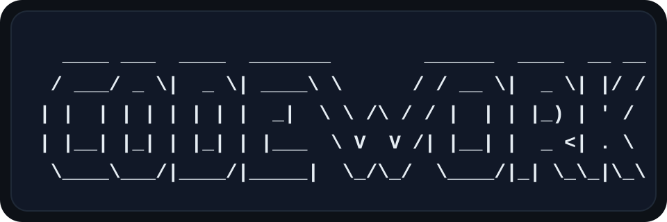

# CODEWORK

  

Toolkit for building AI agents.

## Acknowledgements

The curiosity for building was inspired by by the great work of Mario Zechner on [Pi-Mono](https://github.com/badlogic/pi-mono).

## License

MIT
