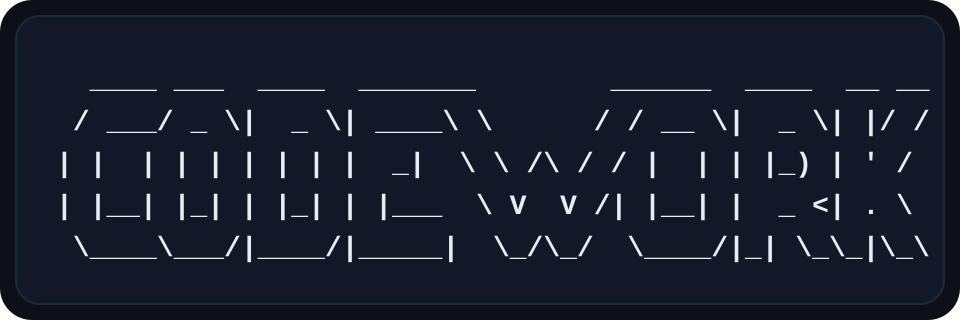

# CODEWORK

<p align="center" dir="auto">
  <a href="https://codework.sh" rel="nofollow">
    
  </a>
</p>

<p align="center">
  <a href="https://www.npmjs.com/package/@codeworksh/cli"></a>
  <a href="https://deepwiki.com/codeworksh/codework"></a>
</p>

An open-source coding agent for your terminal: run sessions in your repo or an isolated sandbox, on any model, extended with plugins.

> Under active development; APIs may change.

## Quick start

```bash
pnpm add -g @codeworksh/cli
export ANTHROPIC_API_KEY=...   # or OPENAI_API_KEY, XAI_API_KEY, ...
codework run "Inspect and fix the failing tests"
```

Continue a session, pick a model, or move into a sandbox:

```bash
codework run --session <id> "Now add a regression test"
codework run --provider openai --model gpt-5.5 --thinking high "Plan the migration"
codework run --sandbox-driver daytona "Inspect repository"
```

## Features

- **Any model** — OpenAI, Anthropic, Google, xAI, OpenRouter, and more via one catalog (`codework models`).
- **Subscription sign-in** — `codework auth login --openai-codex` or `--github-copilot`.
- **Persistent sessions** — resume any session by ID; state lives in a local database.
- **Sandboxes** — run locally or in `daytona`, `vercel`, `memory`, or `sqldb` sandboxes.
- **Server mode** — `codework serve` owns sessions and sandboxes; clients attach with `--server`.
- **Plugins** — `codework plugin add <pkg>` adds tools, prompts, and sandbox drivers, per project or globally (`-g`).

See the [CLI docs](./packages/codework/README.md) for every command and flag.

## Packages

| Package                                     | Description                                                          |
| ------------------------------------------- | -------------------------------------------------------------------- |
| [`@codeworksh/cli`](./packages/codework)    | The `codework` coding agent CLI.                                     |
| [`@codeworksh/harness`](./packages/harness) | Effect-powered agent runtime with persistent sessions and sandboxes. |
| [`@codeworksh/plugin`](./packages/plugin)   | SDK for tools, prompt plugins, and sandbox drivers.                  |
| [`@codeworksh/aikit`](./packages/aikit)     | Unified multi-provider LLM API with streaming, tools, and usage.     |

## Development

Requires Node.js 24.14.1+ and pnpm.

```bash
git clone https://github.com/codeworksh/codework.git
cd codework
pnpm install
pnpm cli -- --help            # run the CLI from source
pnpm exec vp check
pnpm exec vp run typecheck
```

Read [AGENTS.md](./AGENTS.md) for repository conventions, and [open an issue](https://github.com/codeworksh/codework/issues) for bugs or ideas.

## Acknowledgements

The curiosity to build this project was inspired by Mario Zechner’s work on [Pi-Mono](https://github.com/badlogic/pi-mono).

## License

[MIT](./LICENSE)
